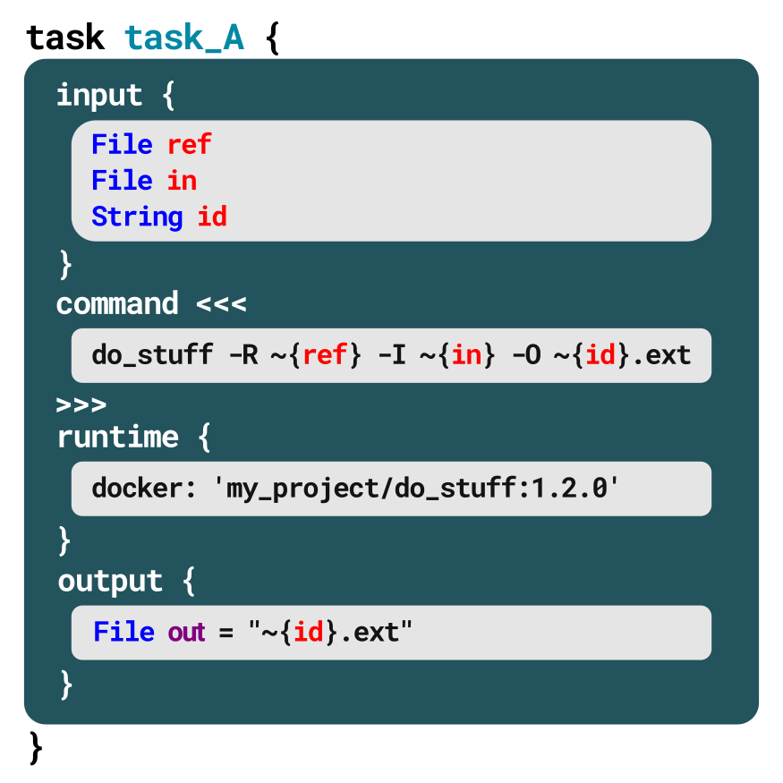
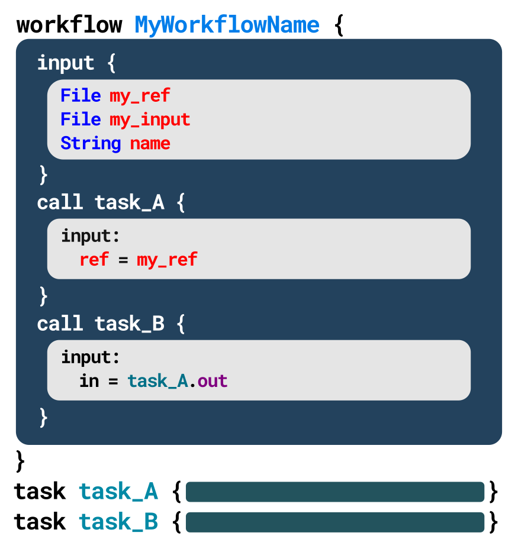

# Add variables

In this context, **variables** are placeholders we write into the script instead of actual filenames and parameter values. We can then specify the filenames and values we want to use at runtime (meaning when we run the script) without modifying the script at all, which is very convenient. We don't have to use variables for everything, mind you -- for some parameters, it makes sense to hardcode the values if they're never going to change from run to run.

So let's look at how to include variables in our WDL script (we'll talk later about how to specify variable values at runtime). There are two different levels at which we might want to include variables: within an individual `task`, or at the level of the whole workflow, so that the variables will be available to any of the tasks it calls. We'll start with task-level variables because it's the simplest case, then build on that to approach workflow-level variables, which come with a few (very reasonable and totally not hard) complications. Over the course of this explanation, we'll touch on how variable values can be inherited from one task to the next, which is a preview for the next topic, on connecting tasks together.

## Adding task-level variables



Let's look at what an example task, `task_A`, actually contains in its `command` and `output` component blocks. We made up an imaginary program called `do_stuff` which presumably does something more interesting than printing "Hello World". This program requires two files to be provided with the arguments `-R` and `-I`, respectively, and produces an output file that must be named using the argument `-O`. 

If we were to hardcode the values, we could just write the command line as we would run it in the terminal:

```
do_stuff -R reference.fa -I input.bam -O variants.vcf
```

To replace these hardcoded values with variables, we first have to *declare* the variables, which is a fancy way of saying we write their name and what type of value they stand for in the `input` block of the task. In the example, `task_A`, there are three inputs declared by `File ref`, `File in`, and `String id`.

Then we can insert the variable name within the command, at the appropriate place, within curly braces and prefaced by a tilde, as in `~{ref}`, `~{in}`, and `~{id}`.

Here for the value of `-O`, we use the variable to specify only a base name. The script will automagically *concatenate* this base name with the `.ext` file extension that we hardcoded, producing the complete output file name from `~{id}.ext`.

Finally, we identify any arguments of the `command` that we want to track as program outputs (in this case, the `-O` argument) and *declare* them by copying their assigned contents to the `output` block, as shown in the example. Notice that here too, we specify the variable type explicitly.

## Adding workflow-level variables



Moving one level out to the body of the workflow, you see that we have also *declared* a set of variables at the top. These declarations follow essentially the same rules as those inside a task. All we need to do now is connect these two levels so that arguments passed to the workflow can be used as inputs to the task.

To do so, we simply add those variables to the `call` function. This block simply contains an `input:` line, followed by additional lines that enumerate which workflow-level variables connect to which task-level variables.

We do something very similar for the second task we're calling in this workflow, `task_B`, with a key difference. We are using the output of `task_A` as the input to `task_B`. Conveniently, we can simply refer to that using a `task_name.output_variable syntax`. In this case, we use `task_A.out`.

Finally, we still need to know how to pass values to the workflow to populate all of those variables, don't we? Yes. Yes, we do.

You could hardcode the values when you declare the variables, of course, and for some parameters that you know will always be the same, it makes sense to do it that way. But there are certainly some variables you need to keep, well, variable, so you don't have to edit your script from run to run.

How that is done in practice is mostly up to the execution engine, not WDL. Pipelining systems typically use one of two main strategies to fulfill this need: either provide the values as part of the command line that launches the workflow execution, or provide a configuration file that lists all the desired values. In the Cromwell execution engine, we prefer to use a file of input definitions, as detailed in a later section, [Specify inputs](./specify_inputs.md).

---

Well, that wasn't so bad. In the next section, we'll look at how we can connect tasks through their inputs and outputs, plus some additional functions, to produce full-featured code without unnecessary complexity.

Go to the next section: [Add plumbing](./add_plumbing.md).

Or, learn more about [what variable types are available in WDL](./variable_types.md).