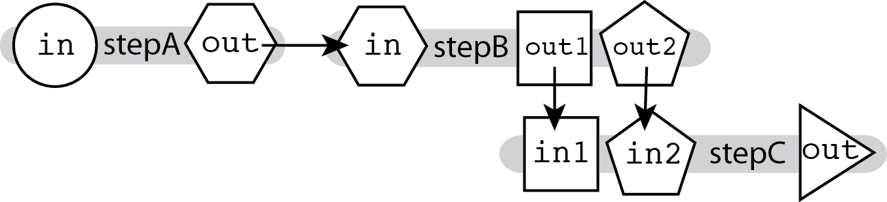

# Multi-input / Multi-output
The ability to connect outputs to inputs described in [Linear Chaining](./Linear_chaining.md), which relies on *hierarchical naming*, allows you to chain together tools that produce multiple outputs and accept multiple inputs, and specify exactly which output feeds into which input.



In the diagram above, we see that the outputs for **stepB** are named differently. This means we can specify where exactly each output goes in the next step's input fields, as shown in the example code snippet below:

```wdl
call stepC { 
  input: 
    in1 = stepB.out1, 
    in2 = stepB.out2 
}
```

## Generic example script

In context, this sort of plumbing would look as follows in a WDL script:

```wdl
version 1.0
workflow MultiOutMultiIn {
  input {
    File firstInput
  }
  call stepA { 
    input: 
      in = firstInput
  }
  call stepB {
   input: 
     in = stepA.out 
  }
  call stepC {
   input: 
     in1 = stepB.out1, 
     in2 = stepB.out2 
  }
}

task stepA {
  input {
    File in
  }
  command <<< 
    programA I=~{in} O=outputA.ext 
  >>>
  output { 
    File out = "outputA.ext" 
  }
}

task stepB {
  input {
    File in
  }
  command <<<
   programB I=~{in} O1=outputB1.ext O2 = outputB2.ext 
   >>>
  output {
    File out1 = "outputB1.ext"
    File out2 = "outputB2.ext" 
  }
}

task stepC {
  input {
    File in1
    File in2
  }
  command <<<
   programB I1=~{in1} I2=~{in2} O=outputC.ext 
  >>>
  output { 
    File out = "outputC.ext" 
  }
}
```
## Concrete example

The example workflow in the diagram below uses Picard’s splitVcfs tool to separate the original VCF into two VCF files, one containing only SNPs and the other containing only Indels. The next step takes those two separated VCFs and recombines them into one.


For this toy example, we have defined two tasks:

* splitVcfs takes in a `File VCF` and outputs a `File snpOut` and a `File indelOut`.
* CombineVariants takes in a `File VCF1` and a`File VCF2`, producing a `File VCF`.

### Concrete example script

The workflow described above, in its entirety, would look like the following in a WDL script:

```wdl
version 1.0
workflow MultiOutMultiInExample {
  input {
    File inputVCF
  }
  call splitVcfs {
   input: 
     VCF = inputVCF
  }
  call CombineVariants { 
    input: 
      VCF1 = splitVcfs.indelOut, 
      VCF2 = splitVcfs.snpOut 
  }
}

task splitVcfs {
  input {
    File VCF
  }
  command <<<
    java -jar picard.jar SplitVcfs \
        I = ~{VCF} \
        SNP_OUTPUT = snp.vcf \
        INDEL_OUTPUT = indel.vcf
  >>>
  output {
    File snpOut = "snp.vcf"
    File indelOut = "indel.vcf"
  }
}

task CombineVariants {
  input {
    File VCF1
    File VCF2
  }


  command <<<
    java -jar GenomeAnalysisTK.jar \
        -T CombineVariants
        -R reference.fasta \
        -V ~{VCF1} \
        -V ~{VCF2} \
        --genotypemergeoption UNSORTED \
        -o combined.vcf
  >>>
  output {
    File VCF = "combined.vcf"
  }
}
```

Note that here for simplicity we omitted the handling of index files, which has to be done explicitly in WDL.